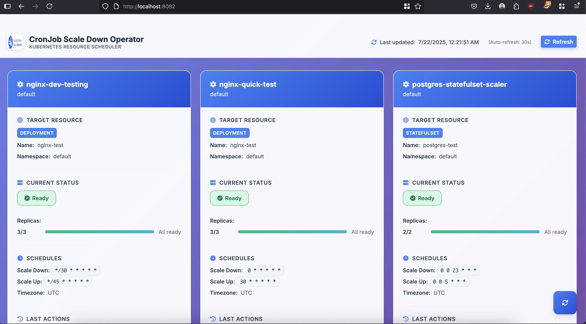

# CronJob-Scale-Down-Operator

A Kubernetes operator that automatically scales down Deployments and StatefulSets during specific time windows (e.g., at night or on weekends) to save resources and costs.

## Features

- 🕒 **Cron-based Scheduling**: Uses standard cron expressions with second precision
- 🌍 **Timezone Support**: Configure schedules in any timezone
- 📈 **Flexible Scaling**: Scale down and up on different schedules
- 🎯 **Multiple Resource Types**: Supports Deployments and StatefulSets for scaling
- 🧹 **Resource Cleanup**: Automatically delete test resources based on annotations
- 🏷️ **Cleanup-Only Mode**: Pure cleanup functionality without scaling any target resources
- 📊 **Status Tracking**: Monitor last execution times and current replica counts
- 🌐 **Web UI Dashboard**: Built-in web interface to monitor all cron jobs and their status
- ⚡ **Efficient**: Only reconciles when needed, with smart requeue timing
- 🛡️ **Safe Testing**: Dry-run mode for cleanup operations
- 🔧 **Graceful Error Handling**: Continues operation even when target resources are missing

## Quick Start

### Prerequisites

- Kubernetes cluster (v1.16+)
- kubectl configured
- Cluster admin permissions

### Installation

#### Option 1: Using Helm (Recommended)

1. **Install using Helm:**
   ```bash
   # Clone the repository
   git clone https://github.com/z4ck404/cronjob-scale-down-operator.git
   cd cronjob-scale-down-operator
   
   # Install the operator
   helm install cronjob-scale-down-operator ./charts/cronjob-scale-down-operator
   ```

2. **Verify installation:**
   ```bash
   kubectl get pods -l app.kubernetes.io/name=cronjob-scale-down-operator
   ```

#### Option 2: Using Container Image

The operator is available as a pre-built container image:

```bash
# Image available at:
docker pull ghcr.io/z4ck404/cronjob-scale-down-operator:0.1.2
```

Use this image in your custom deployments or with the provided Helm chart.

#### Option 3: Using kubectl

1. **Install the CRDs and operator:**
   ```bash
   kubectl apply -f config/crd/bases/
   kubectl apply -f config/rbac/
   kubectl apply -f config/manager/
   ```

#### Quick Test

1. **Create a test deployment:**
   ```bash
   kubectl apply -f examples/test-deployment.yaml
   ```

2. **Apply a scaling schedule:**
   ```bash
   kubectl apply -f examples/quick-test.yaml
   ```

3. **Monitor the scaling:**
   ```bash
   kubectl get cronjobscaledown -w
   kubectl get deployment nginx-test -w
   ```

## Examples

The [`examples/`](../examples/) directory contains various use cases:

| Example | Description | Schedule |
|---------|-------------|----------|
| **[quick-test.yaml](../examples/quick-test.yaml)** | Immediate testing | Every minute |
| **[basic-daily-schedule.yaml](../examples/basic-daily-schedule.yaml)** | Production workload | 10 PM → 6 AM daily |
| **[weekend-shutdown.yaml](../examples/weekend-shutdown.yaml)** | Weekend cost savings | Friday 6 PM → Monday 8 AM |
| **[development-testing.yaml](../examples/development-testing.yaml)** | Dev environment | Every 30/45 seconds |
| **[multi-timezone.yaml](../examples/multi-timezone.yaml)** | Global deployments | Multiple timezones |
| **[statefulset-example.yaml](../examples/statefulset-example.yaml)** | Database scaling | StatefulSet support |
| **[cleanup-only-example.yaml](../examples/cleanup-only-example.yaml)** | **Cleanup only** | **Every 6 hours** |

## Cleanup-Only Mode

The operator supports a cleanup-only mode where it manages resource cleanup without scaling any target resources. This is perfect for environments where you need automated cleanup of test resources, temporary objects, or expired configurations.

### When to Use Cleanup-Only Mode

- **CI/CD Pipelines**: Automatically clean up test resources after builds
- **Development Environments**: Remove temporary test objects on a schedule
- **Resource Management**: Clean up expired ConfigMaps, Secrets, or test deployments
- **Cost Optimization**: Remove unused resources to save cluster costs

### Cleanup-Only Configuration

```yaml
apiVersion: cronschedules.elbazi.co/v1
kind: CronJobScaleDown
metadata:
  name: cleanup-only-job
  namespace: default
spec:
  # No targetRef needed for cleanup-only mode
  cleanupSchedule: "0 0 */6 * * *"  # Every 6 hours
  cleanupConfig:
    annotationKey: "test.example.com/cleanup-after"
    resourceTypes:
      - "ConfigMap"
      - "Secret"
      - "Service"
      - "Deployment"
    namespaces:
      - "test"
      - "staging"
    labelSelector:
      environment: "test"
    dryRun: false
  timeZone: "UTC"
```

### Combined Scaling + Cleanup

You can also combine scaling and cleanup in a single resource:

```yaml
apiVersion: cronschedules.elbazi.co/v1
kind: CronJobScaleDown
metadata:
  name: combined-scaler-cleanup
  namespace: default
spec:
  # Scaling configuration
  targetRef:
    name: my-app
    namespace: default
    kind: Deployment
    apiVersion: apps/v1
  scaleDownSchedule: "0 0 22 * * *"  # Scale down at 10 PM
  scaleUpSchedule: "0 0 6 * * *"     # Scale up at 6 AM
  
  # Cleanup configuration
  cleanupSchedule: "0 0 2 * * *"     # Clean up at 2 AM
  cleanupConfig:
    annotationKey: "cleanup-after"
    resourceTypes: ["ConfigMap", "Secret"]
    dryRun: false
  timeZone: "UTC"
```

## Configuration

### CronJobScaleDown Spec

```yaml
apiVersion: cronschedules.elbazi.co/v1
kind: CronJobScaleDown
metadata:
  name: my-scaler
  namespace: default
spec:
  # Target resource to scale
  targetRef:
    name: my-deployment
    namespace: default
    kind: Deployment  # or StatefulSet
    apiVersion: apps/v1
  
  # When to scale down (cron format with seconds)
  scaleDownSchedule: "0 0 22 * * *"  # 10 PM daily
  
  # When to scale up (optional)
  scaleUpSchedule: "0 0 6 * * *"     # 6 AM daily
  
  # Timezone for schedule interpretation
  timeZone: "UTC"  # or "America/New_York", "Europe/London", etc.
```

### Schedule Format

The operator supports 6-field cron expressions with second precision:

```
┌─────────────second (0 - 59)
│ ┌───────────── minute (0 - 59)
│ │ ┌───────────── hour (0 - 23)
│ │ │ ┌───────────── day of month (1 - 31)
│ │ │ │ ┌───────────── month (1 - 12)
│ │ │ │ │ ┌───────────── day of week (0 - 6) (0 = Sunday)
│ │ │ │ │ │
* * * * * *
```

#### Common Schedule Examples

| Schedule | Description |
|----------|-------------|
| `"0 0 22 * * *"` | Every day at 10:00 PM |
| `"0 0 6 * * 1-5"` | Weekdays at 6:00 AM |
| `"0 0 18 * * 5"` | Every Friday at 6:00 PM |
| `"0 0 0 * * 0"` | Every Sunday at midnight |
| `"*/30 * * * * *"` | Every 30 seconds (testing) |

### Supported Timezones

Use standard IANA timezone names:
- `UTC`
- `America/New_York`
- `Europe/London`
- `Europe/Berlin`
- `Asia/Tokyo`
- `Australia/Sydney`

## Helm Chart Installation

The operator can be installed using Helm for easier management and configuration:

### Chart Information

- **Repository**: `ghcr.io/z4ck404/cronjob-scale-down-operator`
- **Image Tag**: `0.1.2`
- **Chart Version**: `0.1.2`

### Installation Steps

1. **Clone and install:**
   ```bash
   git clone https://github.com/z4ck404/cronjob-scale-down-operator.git
   cd cronjob-scale-down-operator
   helm install cronjob-scale-down-operator ./charts/cronjob-scale-down-operator
   ```

2. **Custom values:**
   ```bash
   helm install cronjob-scale-down-operator ./charts/cronjob-scale-down-operator \
     --set image.tag=0.1.2 \
     --set resources.requests.memory=128Mi \
     --set replicaCount=1
   ```

3. **Upgrade:**
   ```bash
   helm upgrade cronjob-scale-down-operator ./charts/cronjob-scale-down-operator
   ```

4. **Uninstall:**
   ```bash
   helm uninstall cronjob-scale-down-operator
   ```

### Chart Configuration

Key Helm chart values:

| Parameter | Description | Default |
|-----------|-------------|---------|
| `image.repository` | Container image repository | `ghcr.io/z4ck404/cronjob-scale-down-operator` |
| `image.tag` | Container image tag | `0.1.2` |
| `replicaCount` | Number of operator replicas | `1` |
| `resources.limits.memory` | Memory limit | `128Mi` |
| `resources.requests.cpu` | CPU request | `10m` |
| `metrics.enabled` | Enable metrics service | `true` |
| `rbac.create` | Create RBAC resources | `true` |

## Web UI Dashboard

The operator includes a built-in web dashboard that provides real-time monitoring of all CronJobScaleDown resources and their target deployments/statefulsets.



### Accessing the Web UI

By default, the web UI is available at `http://localhost:8082` when running the operator locally. In a Kubernetes cluster, you can access it by:

1. **Port forwarding** (for development/testing):
   ```bash
   kubectl port-forward -n cronjob-scale-down-operator-system deployment/cronjob-scale-down-operator-controller-manager 8082:8082
   ```
   Then visit `http://localhost:8082`

2. **Configure ingress** (for production):
   ```yaml
   apiVersion: networking.k8s.io/v1
   kind: Ingress
   metadata:
     name: cronjob-scale-down-operator-ui
   spec:
     rules:
     - host: cronjob-ui.example.com
       http:
         paths:
         - path: /
           pathType: Prefix
           backend:
             service:
               name: cronjob-scale-down-operator-ui
               port:
                 number: 8082
   ```

### Web UI Features

- 📊 **Real-time Dashboard**: Overview of all CronJobScaleDown resources
- 📈 **Status Monitoring**: Current state of target deployments and statefulsets  
- 🕒 **Schedule Information**: View scale-up/down schedules and timezones
- 📋 **Replica Status**: Visual indicators for ready vs desired replicas
- 📅 **Action History**: Timestamps of last scale operations
- 🔄 **Auto-refresh**: Updates every 30 seconds automatically
- 📱 **Responsive Design**: Works on desktop, tablet, and mobile

### Customizing Web UI Port

You can customize the web UI port using the `--webui-addr` flag:

```bash
./manager --webui-addr=:8080
```

For more details about the web UI, see the [Web UI Documentation](./webui.md).

## Monitoring

### Check CronJobScaleDown Status

```bash
kubectl get cronjobscaledown -o wide
kubectl describe cronjobscaledown my-scaler
```

### View Operator Logs

```bash
kubectl logs -l app.kubernetes.io/name=cronjob-scale-down-operator
```

### Monitor Target Resources

```bash
kubectl get deployment my-deployment -w
kubectl get statefulset my-statefulset -w
```

## Development

### Building from Source

```bash
# Clone the repository
git clone https://github.com/z4ck404/cronjob-scale-down-operator.git
cd cronjob-scale-down-operator

# Build and run locally
make run

# Build Docker image
make docker-build IMG=my-registry/cronjob-scale-down-operator:latest

# Deploy to cluster
make deploy IMG=my-registry/cronjob-scale-down-operator:latest
```

### Running Tests

```bash
# Unit tests
make test

# End-to-end tests
make test-e2e
```

## Troubleshooting

### Common Issues

1. **Scaling not happening:**
   - Check timezone configuration
   - Verify cron schedule syntax
   - Check operator logs for errors

2. **Permission errors:**
   - Ensure RBAC is properly configured
   - Verify service account permissions

3. **Target resource not found:**
   - Check namespace and resource name
   - Verify resource exists and is accessible

### Debug Commands

```bash
# Check CRD installation
kubectl get crd cronjobscaledowns.cronschedules.elbazi.co

# Verify operator deployment
kubectl get deployment -l app.kubernetes.io/name=cronjob-scale-down-operator

# Check events
kubectl get events --sort-by=.metadata.creationTimestamp
```

## Contributing

1. Fork the repository
2. Create a feature branch
3. Make your changes
4. Add tests
5. Submit a pull request

## License

Licensed under the Apache License, Version 2.0. See [LICENSE](../LICENSE) for details.

## Support

- 📧 **Issues**: [GitHub Issues](https://github.com/z4ck404/cronjob-scale-down-operator/issues)
- 📖 **Documentation**: [docs/](.)
- 💬 **Discussions**: [GitHub Discussions](https://github.com/z4ck404/cronjob-scale-down-operator/discussions)